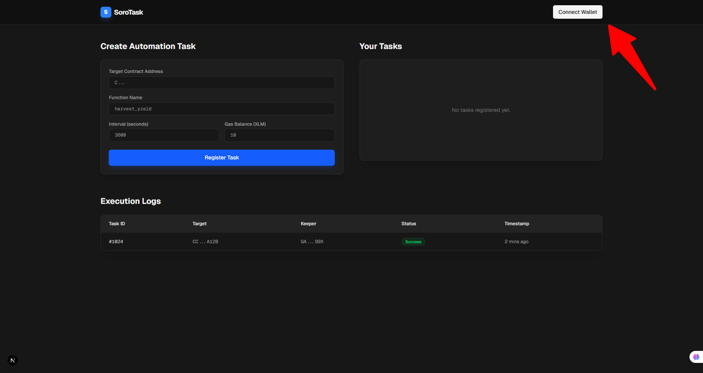
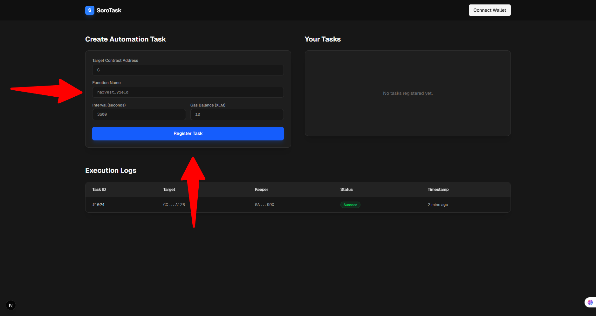
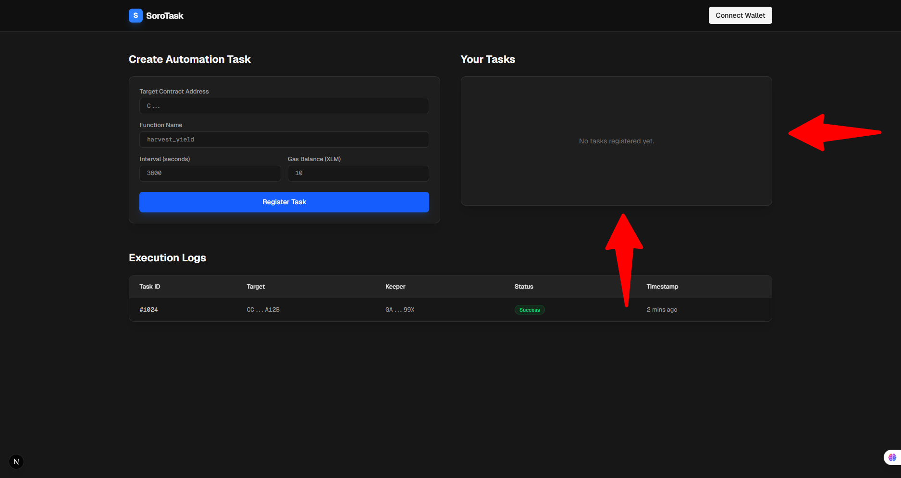
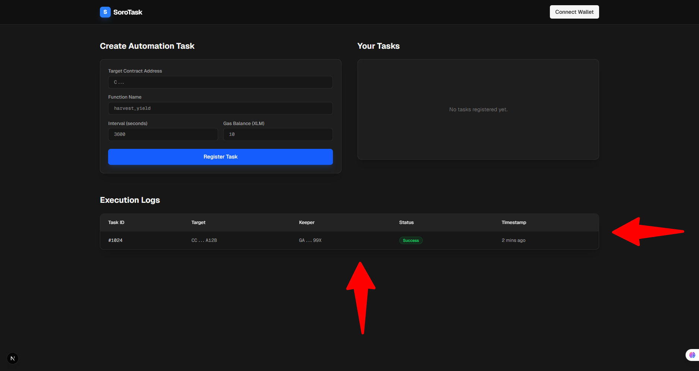

# SoroTask Frontend - User Guide

This directory contains the frontend for SoroTask, a decentralized automation platform on the Stellar network. This guide is intended for **Task Creators** to help them navigate the dashboard.

---

## 1. Wallet Connection
SoroTask is a non-custodial application that interacts with the Stellar network via the **Freighter Wallet**.

* **Prerequisite:** Install the [Freighter browser extension](https://www.freighter.app/).
* **Connecting:** Click the **"Connect Wallet"** button in the top-right header.
* **Approval:** Approve the connection request in the Freighter pop-up.
* **Verification:** The header will update to show your connected status once authorized.

---

## 2. Registering an Automation Task
The **"Create Automation Task"** form allows you to register new recurring jobs for any Soroban smart contract.

### Steps (The Happy Path):
1.  **Target Address:** Paste the contract ID (starting with `C...`) into the **Target Contract Address** field.
2.  **Function:** Enter the specific function name (e.g., `harvest_yield`).
3.  **Interval:** Enter the delay between executions in seconds.
4.  **Gas Funding:** Enter the amount of XLM for the **Gas Balance** to fund execution fees.
5.  **Submit:** Click the blue **"Register Task"** button.

*Note: In the current build, signing the transaction in Freighter is the final step before the task is recorded.*

---

## 3. Managing Your Tasks
The **"Your Tasks"** panel (located to the right of the registration form) displays your live automations.

* **Status View:** Monitor which tasks are currently registered.
* **Coming Soon:** The following management flows are being integrated into this section:
    * **Deposit:** Add XLM to an active task's gas balance.
    * **Cancel:** Stop a task and de-register it.
    * **Withdraw:** Reclaim remaining XLM from a canceled task.

---

## 4. Execution Logs (Monitoring)
The **"Execution Logs"** table at the bottom of the dashboard provides a transparent history of every automated attempt made to trigger your contract.

| Column | Definition |
| :--- | :--- |
| **Task ID** | A unique identifier assigned to your specific registered task (e.g., `#1024`). |
| **Target** | The specific contract address receiving the automated call. |
| **Keeper** | The address of the node or entity that executed the task on the network. |
| **Status** | **Success** (Green) indicates a completed call; **Failed** (Red) indicates a revert or out-of-gas error. |
| **Timestamp** | Indicates how long ago the execution occurred (e.g., `2 mins ago`). |

> 

---

## 5. Quick Troubleshooting (Happy Path)

- Freighter pop-up not appearing: ensure extension is installed, unlocked, and allowed on the current site.
- Transaction rejected: confirm enough XLM is available for fees/funding.
- No visible state change after action: refresh and verify wallet/account network match.
- Failed status in logs: re-check target contract address, function name, and task parameters.